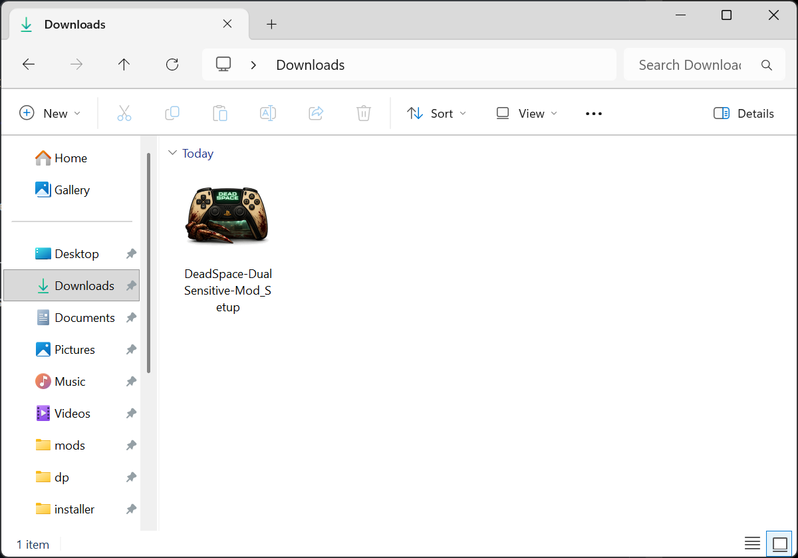
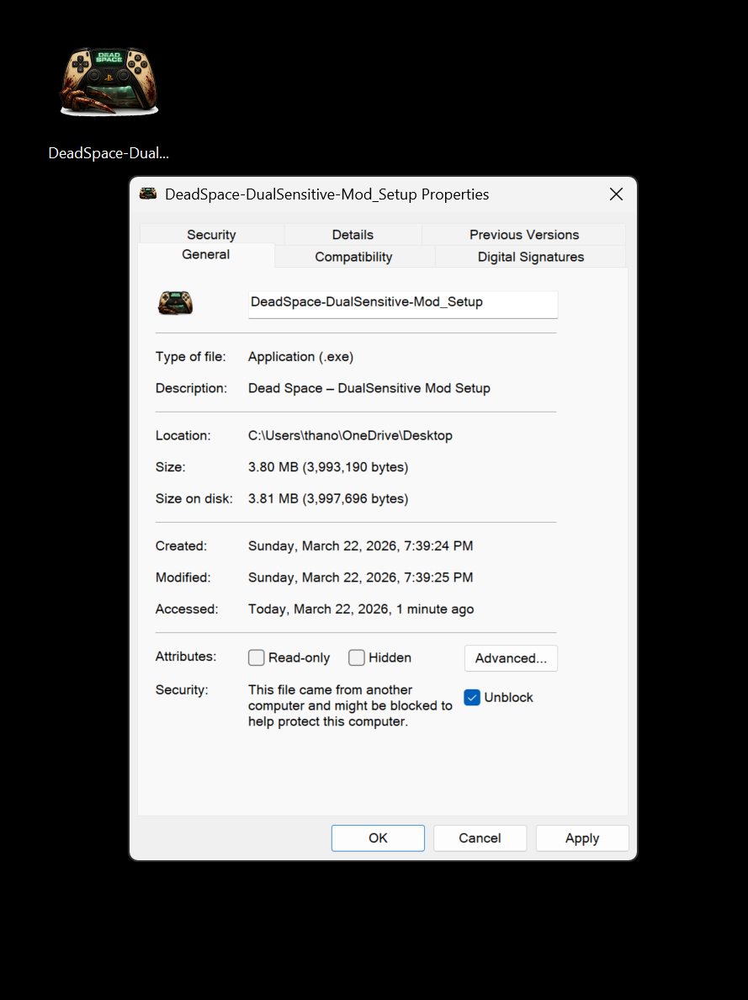
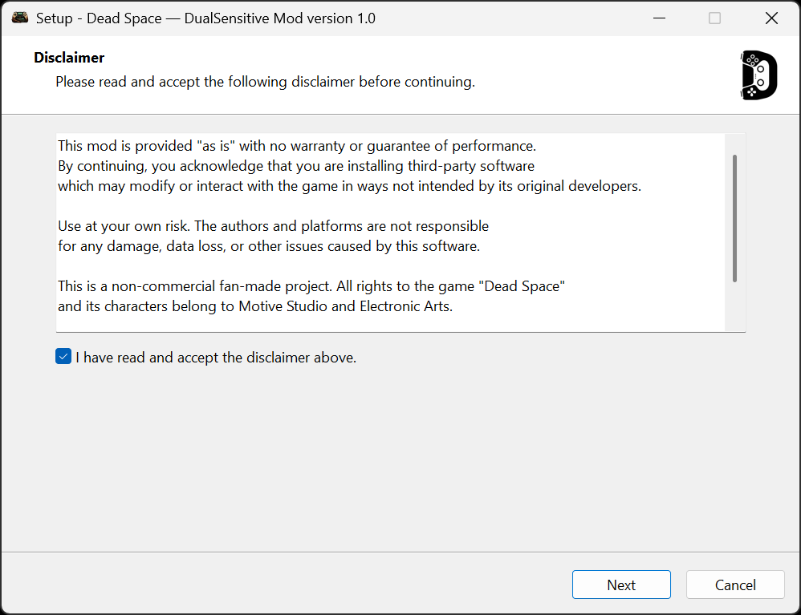
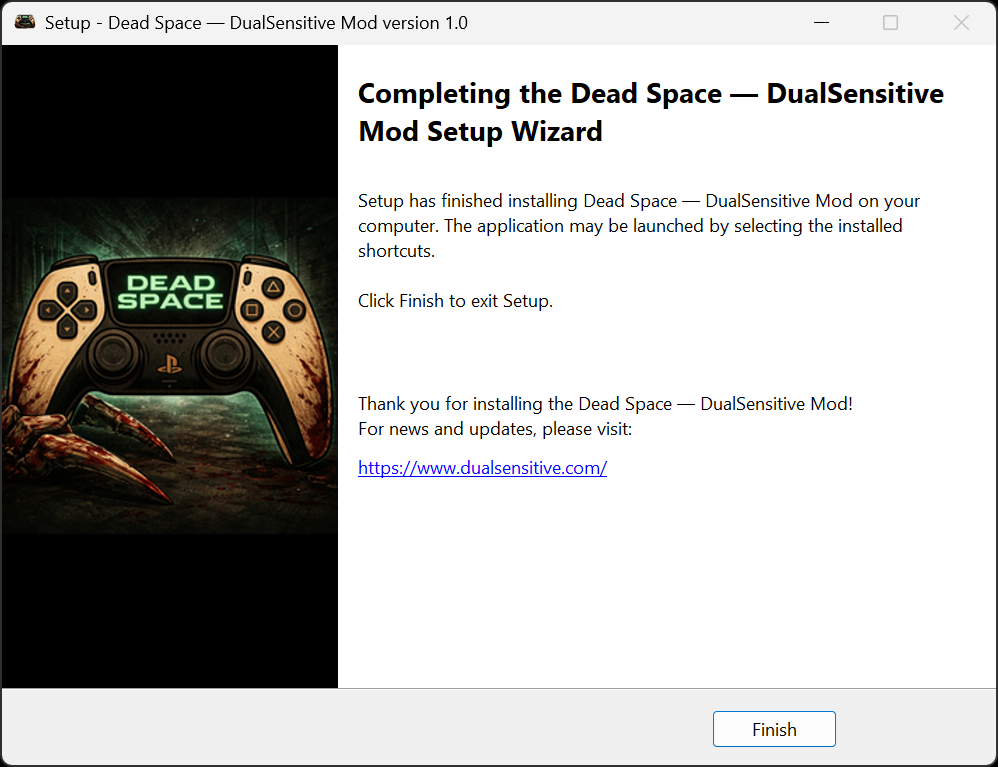
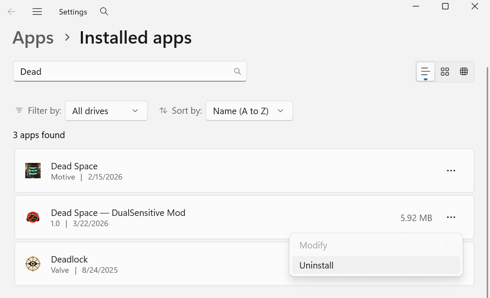

# dead-space-dualsense-mod

[installer-link]: https://github.com/tpetsas/dead-space-dualsense-mod/releases/latest/download/DeadSpace-DualSensitive-Mod_Setup.exe

A mod for Dead Space (2023) that adds DualSense adaptive triggers for all the Weapons!

Make us whole again! With DualSense is much more immersive! :godmode::metal:

Built with the tools and technologies:

[](https://cmake.org/)


[](https://github.com/tpetsas/dualsensitive)
[](https://ghidra-sre.org/)
[](https://rada.re/n/radare2.html)


## Overview

This mod allows players with a Playstation 5 DualSense controller to play Dead Space (2023) with adaptive triggers. The adaptive triggers are assigned based on the current weapon used.

Mod Page: [**Nexus Mods — Dead Space DualSense Mod**](https://www.nexusmods.com/deadspace2023/mods/TODO/)

Installer: [**DeadSpace-DualSensitive-Mod_Setup.exe**][installer-link]

## Features

This mod adds the following features:
- Adaptive Triggers for both L2 and R2 for each weapon
- Adaptive triggers get disabled when the player is on an inner Menu or the game is paused

## Installation

[Dead Space DualSense Mod (latest)]: https://github.com/tpetsas/dead-space-dualsense-mod/releases/latest

### :exclamation: Windows SmartScreen or Antivirus Warning

If Windows or your antivirus flags this installer or executable, it's most likely because the file is **not digitally signed**.

This is a known limitation affecting many **open-source projects** that don't use paid code-signing certificates.

#### :white_check_mark: What you should know:
- This mod is **open source**, and you can inspect the full source code here on GitHub.
- It **does not contain malware or spyware**.
- Some antivirus programs may incorrectly flag unsigned software — these are known as **false positives**.

**1. Download the **[DeadSpace-DualSensitive-Mod_Setup.exe][installer-link]** from the latest version ([Dead Space DualSense Mod (latest)])**


**2. Double click the installer to run it:**



You may safely proceed by clicking:

> **More info → Run anyway** (for SmartScreen)  
> or temporarily allow the file in your antivirus software.
>
> If for any reason the "Run anyway" button is missing you can just do the process manually by:  
> Right-click setup.exe → Properties → Check "Unblock" → Apply




**3. Accept the disclaimer and follow the prompts until the setup is complete:**




**Once all steps are completed, you will reach the final screen indicating that the setup is finished:**




Now, you can experience the mod by just running the game.

> [!NOTE]
> If you have the game from EA App you need to add it to your Steam library first as the game doesn't have support for PS5 controller by default. Open your Steam client, go to **Games > Add a Non-Steam Game to My Library** and choose the game you want to add. If it's not listed, click Browse and find the game. Click Add Selected Programs and the game will now be listed in your Steam library.

## Uninstallation

To uninstall the mod, simply go to **Settings > Add or remove programs**, locate the mod, choose uninstall and follow the prompts:



## Usage & Configuration
[tray-options]: https://github.com/tpetsas/dualsensitive/blob/main/README.md#tray-application-options

The mod will start as soon as the game is started. You can enable/disable the adaptive triggers feature any time from the tray app. For more information, check the [DualSensitive Tray Application Options section][tray-options]. The tray app closes automatically when the game exits.

The mod supports two configuration options as of now via an INI file stored in the `mods` directory named `dualsense-mod.ini`

A sample content of the file is the following (also found in the current repo at `config/dualsense-mod.ini`):


```
[app]
debug=true
```

In this configuration, the `debug=true` option of the `[app]` section will make the mod to output a lot more information to its respective log file (`mods\dualsensemod.log`). The default value of the above option (i.e., if no INI file is used) is `debug=false`.

## Issues

Please report any bugs or flaws! I recommend enabling the `debug` option in the configuration as described above ([Configuration](#usage--configuration)) in order to get a fully verbose log when trying to replicate the issue, which will help me a lot with debugging the issue. Feel free to open an issue [here](https://github.com/tpetsas/dead-space-dualsense-mod/issues) on GitHub.

## Credits

[Tsuda Kageyu](https://github.com/tsudakageyu), [Michael Maltsev](https://github.com/m417z) & [Andrey Unis](https://github.com/uniskz) for [MinHook](https://github.com/TsudaKageyu/minhook)! :syringe:
